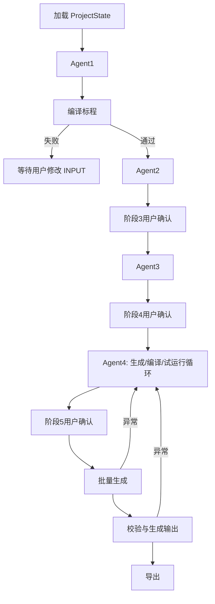

# 智能体编排框架选型对比与落地说明

## 1. 选型结论

建议在新的工作流中只使用 **LangGraph** 作为智能体编排框架，不与 Dify、AgentScope 或 LangChain 组合为运行时主链路。

这版流程的关键需求是：持久化的全局状态 `INPUT`/`SUBTASKS`、阶段内自循环、确定性工具结果驱动的修复、人工确认中断、阶段 6/7 定向回流 Agent4，以及按修订号恢复执行。LangGraph 是四者中最贴合这些需求的低层状态图框架，并且可独立使用，不要求同时引入 LangChain。

保留现有 Docker 沙箱、Python FastAPI 后端、AgentToolGateway、testlib、jngen 和 DeepSeek 的 OpenAI 兼容接口；这些是业务执行与安全边界，不需要迁移给智能体框架。

## 2. 当前目录的事实基础

| 目录 | 当前可见能力 | 对本项目的直接含义 |
| --- | --- | --- |
| `dify/` | 自托管应用、可视工作流、模型管理与 Workflow API 的本地参考仓库。 | 不再进入本项目运行时；旧 DSL 和服务已从后端与部署链路移除。 |
| `agentscope/` | Python Agent 框架，含事件、人机协作、权限系统、会话服务和 Docker 等工作区后端。 | 能完成多 Agent 与工具封装，但默认能力广，必须额外收紧内置 Shell、文件操作和工作区能力。 |
| `langchain/` | 模型/工具/提示词集成与可组合组件库。 | 适合作为模型调用辅助库，但不是这类持久循环工作流的状态机。 |
| `langgraph/` | 面向长运行、有状态流程的图编排；目录 README 明确列出 durable execution、human-in-the-loop、memory 和可独立使用。 | 与 `INPUT`、`SUBTASKS`、循环修复、人工确认和回流路径一一对应。 |

## 3. 需求匹配对比

| 关键需求 | Dify | AgentScope | LangChain | LangGraph |
| --- | --- | --- | --- | --- |
| `INPUT`、`SUBTASKS` 作为全局显式状态 | 需由后端另行维护 | 可自行实现 | 可自行实现 | 原生适合以 Typed State/Reducer 建模 |
| Agent 自循环直到完成 | 可通过工作流节点拼接，但复杂循环与退出条件维护成本高 | Agent 循环能力强 | 需自行编排 | 图上的条件边和循环节点直接表达 |
| 编译/运行结果驱动修复 | 需跨 Dify 与后端传递状态 | 可实现 | 可实现 | 节点结果写回状态后路由到修复节点 |
| 用户确认后暂停/恢复 | 有交互节点，但业务确认仍要与后端协调 | 可实现 | 需自行实现 | interrupt/checkpointer 模型与此直接匹配 |
| 阶段 6/7 回流 Agent4 | 视觉上可画，跨阶段和持久重入较繁琐 | 可实现 | 需自行实现 | 明确的边：`batch/validate failure -> agent4` |
| 修订、检查点和失败恢复 | 需要额外业务实现 | 需要选择存储和协议 | 需要自行实现 | durable execution/checkpoint 是核心定位 |
| 严格工具最小权限 | 必须继续依赖后端网关 | 自带权限概念，但默认工具面较宽 | 依赖后端网关 | 依赖后端网关，边界清晰 |
| 与当前 Python 后端融合 | 已存在，但形成双编排层 | 需引入新服务模型 | 轻量但不足以编排 | 可嵌入现有 FastAPI 服务 |
| 本项目推荐度 | 不推荐作为主编排 | 备选 | 不单独选用 | 推荐 |

## 4. 为什么不选 Dify 作为主编排

旧原型曾由 Dify Workflow 将“任务 LLM -> JSON 归一化 -> 检查 LLM”串联起来。它适合验证提示词和模型连通性，但新需求会让它与 Python 后端同时承担状态机职责：后端掌握项目、修订、Docker 工具和用户确认，Dify 又要维护循环、等待和回流。这会产生两套状态来源，特别是在阶段 6/7 失败后难以可靠恢复到同一版 Agent4 上下文。

如果继续保留 Dify，建议仅作为人工调试提示词或模型配置的独立工具，不进入生产主流程；不要让 Dify Workflow 与 LangGraph 同时编排同一项目。否则“哪个系统决定当前阶段、哪份状态可写、失败后从哪里恢复”会变得含混。

## 5. 为什么不选 AgentScope

AgentScope 的事件、权限、多会话和 Docker 工作区能力确实覆盖本项目部分需求，尤其适合开放式多 Agent 协作产品。不过本项目要求 Agent 绝不直接获得 Shell、文件系统、网络或 Docker 权限，而 AgentScope 本地目录包含 Bash、读写文件和 Docker Workspace 等通用能力。即使可以关闭，仍需要额外设计来确保模型无法绕过现有 `AgentToolGateway`。

同时，本项目的 Agent1--4 是职责明确、状态严格、以确定性编译/校验闭环的工作流，而不是自由通信的 Agent Team。使用 AgentScope 会引入多租户、工作区、服务与工具体系等当前 MVP 不需要的复杂度。

## 6. 为什么不单独选 LangChain

LangChain 适合作为模型提供商、提示词模板和工具适配的通用组件，但它本身不解决跨阶段状态、检查点、人工暂停、循环路由或失败恢复。若只用 LangChain，仍需在 FastAPI 中手写一套状态机；这正是 LangGraph 要解决的部分。

若 LangGraph 的模型适配需要 LangChain 组件，可仅使用极小的 `langchain-core`/模型适配依赖；但推荐先直接使用 OpenAI 兼容 HTTP 客户端或官方 OpenAI Python SDK 调用已配置的 DeepSeek API，以保持“只使用一个编排框架”。

## 7. 推荐落地形态：LangGraph 单框架

建议的状态图节点为：

- `normalize_input`（Agent1）与 `compile_solution`（固定工具节点）
- `analyze_input_structure`、`review_input_structure`、`wait_input_confirmation`（Agent2）
- `plan_subtasks`、`review_subtasks`、`wait_subtasks_confirmation`（Agent3）
- `draft_code`、`compile_code`、`trial_run`、`review_code`、`wait_code_confirmation`（Agent4）
- `batch_generate`、`validate_and_solve`、`export_package`（确定性工具节点）

每个 Agent 节点只生成候选或修订建议。编译、运行、文件读写和导出均是独立工具节点，仍经现有 AgentToolGateway 和 Docker 沙箱执行。条件边依据结构化状态字段路由，例如 `needs_repair`、`waiting_user`、`passed`、`failed`；禁止用模型自由文本直接决定流程走向。

## 8. 已采用的实施边界

1. `INPUT`、`SUBTASKS`、修订号和产物引用由 Python 后端持久化，LangGraph checkpoint 保存智能体循环和用户确认中断。
2. DockerSandbox 与固定校验节点保留为工具边界；模型没有 Shell、宿主机文件、网络或 Docker 权限。
3. Agent1--4 使用同一套 LangGraph 自检循环；阶段 2、6、7、8 保持确定性 Python 服务，不交给 LLM。
4. 生产后端与部署配置不再依赖 Dify Workflow，Dify 不持有任何项目阶段状态。
5. 每个循环设定最大尝试次数和单次模型/工具超时；达到限制后保留候选与中文问题清单，等待人工处理。

该方案只引入 LangGraph 作为编排框架。LangChain、AgentScope 和 Dify 不进入运行时主链路，从而保持单一状态机、单一确认逻辑和单一工具权限入口。
