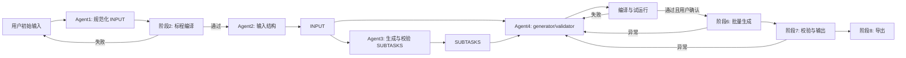

# 竞赛数据生成系统工作流说明（更新审阅稿）

## 1. 目标与总原则

系统以一份全局输入模板 `INPUT` 和一份全局子任务列表 `SUBTASKS` 为唯一业务事实来源。所有阶段读取、校验和生成都基于这两份状态；智能体或用户修改后，必须写回对应状态并使依赖结果失效，避免题目、输入结构、子任务和代码之间出现不一致。

每个智能体都必须在自己的任务边界内执行“生成/执行 -> 观察结果 -> 自检 -> 修复或完成”的循环。智能体不能仅凭一次回答宣布完成；完成必须满足该阶段的明确完成条件，并由确定性检查或受控工具结果佐证。



## 2. 全局状态

### 2.1 `INPUT`

`INPUT` 使用结构化格式保存题目事实和阶段三生成的输入结构。它不是用户界面的固定表单限制，而是后端持久化和智能体上下文的规范对象。

```json
{
  "problem": {
    "description": "题目描述原文",
    "input_description": "题面中的输入说明",
    "output_description": "题面中的输出说明",
    "samples": [{"input": "...", "output": "...", "note": "..."}],
    "difficulty": "难度等级"
  },
  "solution": {
    "language": "cpp",
    "source": "C++ 标程代码",
    "compile": {"status": "pending|passed|failed", "log": "..."}
  },
  "input_structure": {
    "template": "按读取顺序写出的规范输入结构描述",
    "status": "pending|draft|confirmed",
    "revision": 0
  },
  "revision": 0
}
```

- 阶段 1 创建 `INPUT`，阶段 2 写入编译结果，阶段 3 写入规范输入结构。
- 用户修改题目、标程或阶段三输入结构时，修改必须写回 `INPUT` 并递增 `revision`。
- `INPUT.revision` 变化后，依赖旧版本的 `SUBTASKS`、代码草稿、试运行结果和数据批次全部标记为过期，不能继续作为已确认结果使用。
- 智能体若发现必须补充或修正 `INPUT` 才能继续，只能提交带来源和理由的更新建议；涉及题意或输入结构含义的更新必须由用户确认后生效。

### 2.2 `SUBTASKS`

`SUBTASKS` 初始为空，由 Agent3 生成 5 个初始子任务。用户可以新增、删除和修改；每次修改记录 `revision`，并使 Agent4 的代码草稿和后续数据批次过期。

```json
[
  {
    "id": 1,
    "constraints": "自由文本约束",
    "test_count": 10,
    "expected_complexity": "O(n log n)",
    "special_cases": [{"count": 2, "description": "..."}],
    "status": "draft|confirmed"
  }
]
```

其中 `constraints` 保持自由文本，接受自然语言、不等式、区间、键值范围和分行表达。系统保留原文，同时由 Agent3/Agent4 在内部生成可追溯的理解结果；不要求用户改写为固定句式。

### 2.3 运行状态与修订

除 `INPUT` 和 `SUBTASKS` 外，运行状态保存每一次智能体循环的候选产物、受控工具调用、编译日志、试运行结果、问题清单和确认状态。代码、数据和日志必须关联到当时的 `input_revision` 与 `subtasks_revision`；版本不匹配时禁止复用。

## 3. 通用智能体循环

每个 Agent 的一次执行遵循以下受控循环：

1. 读取当前全局状态、当前阶段候选结果、上一次失败原因和允许的工具反馈。
2. 生成或修订候选结果；只能通过后端白名单工具请求编译、运行、校验或读取受控日志。
3. 执行确定性检查或受控工具调用，收集结构化结果和日志摘要。
4. 对候选结果、任务完成条件和执行结果进行自检。
5. 自检未通过时，给出修订结果并回到第 2 步；自检通过时，写入候选修订，进入用户确认或下一阶段。

循环必须设置每阶段最大尝试次数、总运行时间、单次工具调用上限和上下文大小上限。达到上限仍未完成时，不得伪造通过；系统保留最近有效候选、失败日志和中文问题清单，转为“需要用户处理”。

上下文采用“当前规范状态 + 当前候选 + 最近一次完整工具反馈 + 压缩的历史修订摘要”的形式。源码、完整日志和大数据文件不反复塞入模型上下文，而是由后端保存为修订产物，只提供受控摘要、差异和必要片段。

## 4. 八阶段流程

### 阶段 1：创建项目与 Agent1 规范化输入

用户提交题目描述、C++ 标程和难度等级。Agent1 负责从用户材料中补齐 `INPUT.problem.input_description`、`output_description` 和样例的规范位置，并保留原始题目描述与标程，不改变题意。

**Agent1 完成条件：** `INPUT` 包含题目描述、输入说明、输出说明、标程、难度和可用样例信息；缺失信息被明确标为缺失而不是臆造；所有内容可追溯到用户输入。

若用户修改题目或标程，重新运行 Agent1 并使阶段 2 及以后结果失效。

### 阶段 2：标程编译检查

此阶段是固定确定性流程，不由智能体决定。系统在 Docker 沙箱中使用固定编译命令编译 `INPUT.solution.source`，并把状态和日志写回 `INPUT.solution.compile`。

**通过条件：** 编译退出码为 0，且生成可执行标程。

**失败处理：** 立即将可读错误日志反馈给用户，等待用户修改标程。修改后更新 `INPUT` 并从阶段 1/2 重新开始；不进入 Agent2。

### 阶段 3：Agent2 生成并确认输入结构

Agent2 读取 `INPUT`，综合题目与标程实际读取逻辑生成按读取顺序描述的规范输入结构文本，写入 `INPUT.input_structure.template`。它先检查题面与标程是否矛盾，再自检模板是否包含类型、读取顺序、数量关系、重复关系和关键依赖。

用户可直接编辑该模板；用户编辑同样写回 `INPUT`。用户或 Agent2 的修改会使 `SUBTASKS`、Agent4 代码和后续数据过期。

**Agent2 完成条件：** 输入结构能解释标程的读取行为；不存在未标记的题面/标程矛盾；模板没有缺失后续规划必需的变量、结构或依赖。通过自检后仍需用户确认，才将 `status` 设为 `confirmed`。

### 阶段 4：Agent3 生成并确认子任务

Agent3 读取已确认的 `INPUT`，自动生成 5 个初始 `SUBTASKS`，覆盖题目合理的规模梯度、期望复杂度和必要的非规模特殊数据。用户可自由增删改子任务；约束仍使用自由文本。

Agent3 对修改后的列表循环执行解析、一致性检查和覆盖检查：确认约束能基于 `INPUT.input_structure` 理解、特殊测试点数量不超过总数、复杂度目标与规模约束不自相矛盾。含义明确的变量名轻微差异自动归一；真正不可解析或冲突才反馈用户。

**Agent3 完成条件：** 恰好先生成 5 个初始子任务；当前 `SUBTASKS` 中每项均可解释、总测试点为正、特殊项数量合法、复杂度目标可判断；列表整体能为 Agent4 提供明确代码生成依据。通过自检后仍需用户确认。

### 阶段 5：Agent4 生成、执行与修复代码

Agent4 读取已确认的 `INPUT` 和 `SUBTASKS`，生成一套通用 `generator.cpp` 与 `validator.cpp`。生成器应根据子任务编号选择相应约束，并通过受控参数接收种子；复杂数据结构使用本地 jngen，校验器使用本地 testlib。

Agent4 的循环包括：生成代码、在 Docker 沙箱编译、针对每个子任务以多个种子试运行、用 validator 检查生成输入、运行标程确认输出可生成，并根据失败日志修复代码。每次修订只携带当前代码、受控日志、相关子任务和必要的 `INPUT` 摘要进入下一轮。

**Agent4 完成条件：** generator、validator 与标程均编译成功；每个子任务至少有一次成功试运行；生成数据均通过 validator；标程能为试运行数据生成输出；代码和测试结果关联到当前 `INPUT`/`SUBTASKS` 修订。满足后由用户审核代码和试运行结果并确认。

### 阶段 6：批量生成数据

用户可以全选子任务，也可以选择任意子集执行批量生成。系统按确认的测试点数量、子任务号和内部编号生成输入文件；每个批次保存所用代码修订、子任务修订、种子和执行日志。

**通过条件：** 所选每个子任务均生成到目标数量，所有生成过程正常结束。

**异常处理：** 编译、运行超时、生成失败、数量不足或违反已确认约束时，冻结当前批次并把子任务、种子、命令结果和日志摘要反馈给 Agent4。Agent4 修复并重新通过阶段 5 的验证后，用户重新选择需要生成的范围。

### 阶段 7：验证与输出生成

系统使用 validator 校验每份输入，再运行标程生成配对输出。仅保留同时通过校验和标程执行的输入输出对。

**通过条件：** 所选批次中每一份输入通过 validator，且都成功生成对应输出。

**异常处理：** validator 拒绝、标程运行失败、输出缺失或文件配对异常时，将相关输入、子任务、代码修订和日志反馈给 Agent4。修复后的代码必须重新完成阶段 5 验证；受影响数据重新生成和校验。

### 阶段 8：导出数据包

导出 `generator.cpp`、`validator.cpp` 和最终输入输出数据，不导出报告文件。文件命名遵循 `子任务号_内部编号.in` 与 `子任务号_内部编号.out`，两个编号均为无前置零的自然数。

**通过条件：** 每个导出输入均存在同名输出，且产物均来自当前确认的代码和子任务修订。

## 5. 确认、回退与失效规则

| 变化来源 | 必须更新 | 必须失效 | 回到的阶段 |
| --- | --- | --- | --- |
| 用户修改题目或标程 | `INPUT` | 输入结构、`SUBTASKS`、代码、数据 | 阶段 1/2 |
| 标程编译失败 | `INPUT.solution.compile` | 阶段 3 及以后结果 | 阶段 1/2 |
| 用户或 Agent2 修改输入结构 | `INPUT` | `SUBTASKS`、代码、数据 | 阶段 3 |
| 用户或 Agent3 修改子任务 | `SUBTASKS` | 代码、试运行、数据 | 阶段 4 |
| Agent4 代码/试运行失败 | 代码候选与运行日志 | 当前代码确认和受影响数据 | 阶段 5 |
| 阶段 6/7 执行失败 | 批次日志与失败样本 | 受影响数据；必要时当前代码确认 | 阶段 5 |

阶段 3、4、5 均要求“Agent 自检通过 + 用户明确确认”两个条件。阶段 2、6、7、8 由确定性程序决定通过；发生问题时按表回流，不能跳过必要复验。

## 6. 权限与审计边界

智能体不拥有 Shell、Docker Engine、宿主机路径、网络和任意文件读写权限。它们只能发起后端预定义的结构化请求，例如编译指定修订、运行指定子任务与种子、校验指定临时文件、读取经过裁剪的日志。后端工具网关负责参数白名单、当前阶段、修订归属、调用次数、超时和资源限制。

每一次 Agent 循环、用户确认、全局状态更新、代码修订和批次执行都记录关联修订号。这样阶段 6/7 的错误能够精确回放给 Agent4，也可以证明最终导出的数据来自哪一版 `INPUT`、`SUBTASKS` 和代码。
