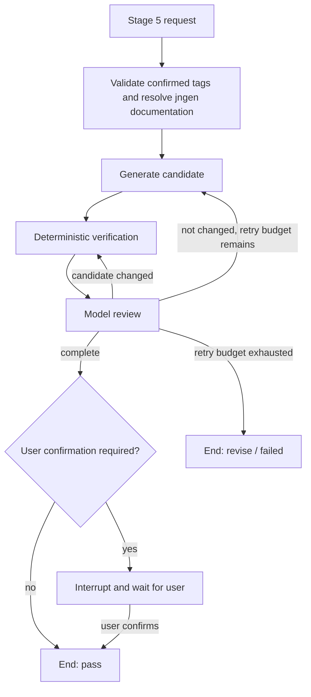

# Stage 5 LangGraph Orchestration: Executable Logic Specification

## 1. Purpose and Scope

Stage 5 (`CODE_DRAFT`) produces a contest test-data generator, a testlib validator, and a per-test-point constraint coverage table. It is not a free-form code-writing chat. It is a bounded repair workflow in which the language model proposes code, while the backend owns retrieval, compilation, execution, validation, persistence, retry limits, and user approval.

This document specifies the target orchestration after adopting the confirmed Stage 3 structure-tag design. It is intentionally implementation-neutral so that it can be reviewed or redesigned without first reading the Python source.

The workflow assumes that:

- The official solution has compiled successfully.
- Stage 3 (input structure) and Stage 4 (subtask plan) have both been confirmed by the user.
- Stage 3 has produced a valid, confirmed structure-tag list from the versioned tag catalog.
- Stage 4 contains per-test-point runtime parameters for every declared test case.

The final Stage 5 output is only eligible for user confirmation after deterministic validation has succeeded and the model has returned a passing review decision.

## 2. Responsibility Boundary

| Component | Owns | Must not own |
| --- | --- | --- |
| Language model | Code proposal, local semantic review, explanation of issues, field-level repair patch | Shell access, files, Docker, network, arbitrary tool calls, acceptance decision |
| LangGraph runner | State transitions, bounded retry loop, candidate fingerprinting, document-refresh gate, timing | C++ compilation or test execution |
| Deterministic verifier | Static policy checks, compilation, test generation, validator execution, official-solution execution, failure classification | Open-ended code reasoning or user confirmation |
| User | Final approval of a completed candidate | Repair-loop control during a single run |

The model is therefore advisory. A model `pass` cannot override a failed deterministic check, and a deterministic pass alone cannot bypass the model review or user confirmation.

## 3. Main State

The LangGraph state contains the following conceptual fields:

| Field | Meaning |
| --- | --- |
| `run_id` | Unique run identifier, also used as the checkpoint thread identifier. |
| `project_id` | Persistent project identifier. |
| `task_type` | `CODE_DRAFT` for this stage. |
| `context` | Confirmed input, input structure, confirmed Stage 3 tags, optional Stage 4 refinements, catalog version, resolved jngen documents, and optional recovery feedback. |
| `candidate` | Current generator, validator, and constraint coverage candidate. |
| `execution` | Latest deterministic verification result and bounded evidence. |
| `issues` | Deduplicated unresolved review or verification issues. |
| `attempts` | Number of repair iterations already consumed. |
| `max_iterations` | Configured repair limit. |
| `round_index` | Human-readable round number for timing and audit records. |
| `candidate_changed` | Whether review produced a change that still needs deterministic verification. |
| `complete` / `exhausted` | Terminal success and terminal retry-limit flags. |
| `requires_user` / `user_confirmed` | Whether the graph should pause for human approval and whether that pause was resumed. |

The graph is checkpointed in SQLite. A completed candidate can therefore pause at the confirmation boundary and later resume without rerunning generation or validation.

## 4. High-Level State Machine



There are only three executable LangGraph nodes in the repair loop:

1. `generate`
2. `verify`
3. `review`

`wait_user` is an interrupt node rather than an automatic repair step.

## 5. Tag-Driven jngen Documentation Preparation

Before the graph enters `generate`, Stage 5 resolves a bounded set of jngen documents from the **confirmed Stage 3 tag list**. The model must treat the resolved document bodies as its only source of truth for jngen APIs.

### 5.1 Normal path: deterministic tag resolution

The normal path does not inspect raw Chinese or English wording, and it does not inspect the official solution source. It consumes only:

- confirmed global Stage 3 structure tags;
- optional, valid Stage 4 subtask refinements;
- the versioned tag catalog.

For each effective tag set, the resolver:

1. validates that every tag ID exists in the catalog;
2. expands parent and implied tags deterministically;
3. rejects conflicts and `unsupported` / `manual_only` tags;
4. unions the tag-mapped jngen documents and their dependencies;
5. removes duplicate filenames while preserving catalog order;
6. checks the combined document body against the configured context-character budget.

The resolved set must be non-empty. The audit record stores the confirmed tags, any Stage 4 refinements, catalog version, resolved filenames, and the deterministic termination reason.

Consequently, the same confirmed tag set must resolve to the same document set regardless of whether the problem statement is written in English or Chinese.

### 5.2 Explicit exception path for tag uncertainty

`needs_tag_review`, unknown tags, conflicting tags, and unsupported tags are visible Stage 3 / Stage 4 issues. They must not silently fall back to keyword matching.

An explicitly configured recovery path may use bounded model document selection only when the audit record states a concrete fallback reason, such as `needs_tag_review` or an approved unsupported-tag recovery. The selector may choose only existing unread documents, has a fixed document and context budget, and records every selection round.

This exception path is not the normal language-routing mechanism. Its output should be used to improve the catalog or the confirmed tags after review.

### 5.3 Repair retrieval is explicitly gated

The workflow does **not** re-run document retrieval after every failed compile or trial. A repair retrieval is allowed only when deterministic verification explicitly sets:

```text
retrieval_required = true
```

This signal means that the confirmed tags or their resolved documentation are insufficient for the reported failure. Ordinary parameter, testlib, compile, generation, validation, and official-solution failures go directly to targeted model review.

When repair retrieval is allowed, the verifier feedback is bounded and attached to `context.recovery_feedback`; the model can then select additional unread documents. The fallback reason and newly selected documents are audited.

## 6. Generate Node

The `generate` node sends the current context, candidate, previous issues, and prior execution feedback to the model with phase `generate`. The context includes the confirmed effective tag set, catalog version, and tag-resolved jngen documents; it does not ask the model to infer structure from raw wording.

Expected output for Stage 5 is a complete candidate containing:

- `generator_code`
- `validator_code`
- `constraint_coverage`

Each coverage record must additionally carry the effective tag IDs for its `(subtask_id, case_id)`, so the declared construction and validation strategy can be audited against the structural assumptions used to resolve jngen documentation.

The model is expected to use jngen for generation, testlib for validation, and runtime command-line parameters for each test point.

The node replaces the candidate only when the model returns a non-empty result. It clears prior execution data and resets completion flags. It does not decide whether the candidate is valid.

## 7. Deterministic Verification Node

The `verify` node is the primary correctness gate. It receives the candidate and adds a transient timing context, but does not expose timing implementation details to the model.

It returns:

```text
(normalized_candidate, execution_result)
```

The runner then stores a fingerprint of the exact verified candidate inside `execution_result`.

### 7.1 Static checks

Verification stops immediately on the first failing layer.

1. Validate the candidate against the Stage 5 schema.
2. Require a non-empty tag-resolved jngen documentation context, together with a valid confirmed tag list and catalog version.
3. Check generator policy:
   - includes jngen;
   - initializes and parses generator arguments correctly;
   - uses a selected jngen generation API;
   - reads `seed`, `subtask`, `case`, and every Stage 4 runtime parameter through `getOpt`.
4. Check validator policy:
   - includes testlib;
   - registers validation correctly;
   - reads through testlib input APIs;
   - performs exactly one end-of-file check;
   - does not bypass testlib with `cin` or `scanf`.
5. Load the confirmed Stage 4 plan and require per-test-point runtime parameters.
6. Resolve the effective tag set for each test point: global Stage 3 tags plus any valid Stage 4 refinement.
7. Check that every test-point profile contains the runtime parameters required by its effective supported tags.
8. Compare the candidate coverage table with the plan. Every `(subtask_id, case_id)` must appear exactly once, list exactly that test point's parameter names, and reference its effective structural tags.

### 7.2 Compilation

If static checks pass, the candidate is persisted and the following programs are compiled concurrently:

- official solution;
- generator;
- validator.

Compiler diagnostics are parsed and preserved as structured evidence. Any failed compilation ends this verification pass.

### 7.3 Trial construction

For every Stage 4 subtask, every runtime-parameter profile, and every configured trial seed offset, the verifier creates one generation job.

The seed is deterministic:

```text
seed = subtask_id * 1,000,003 + case_id * 101 + seed_offset
```

Each job invokes the generator with:

- `subtask`;
- `case`;
- `seed`;
- serialized runtime parameters from that exact test-point profile.

Tag-specific low-cost invariants may be checked before execution. For example, a test point declared as a tree can require `m = n - 1`; a declared permutation can require the corresponding range and uniqueness conditions. These checks complement, rather than replace, generator and validator execution.

### 7.4 Two-level execution validation

Jobs run in two phases:

| Level | Job set | Purpose |
| --- | --- | --- |
| `smoke` | First generated job for every subtask | Fast rejection of broken code or invalid construction logic. |
| `complete` | All remaining jobs | Full configured Stage 5 trial coverage. |

For each level:

1. Generate inputs in bounded batches.
2. Record generation result, seed, case, runtime arguments, and a bounded preview of generated content.
3. Stop on the first failed generation.
4. Validate each generated input with the validator and run the official solution, also in batches.
5. Stop on the first validator failure, missing solution result, or solution failure.

Only after both levels pass does the verifier persist the full trial-results list and return `execution.ok = true`.

### 7.5 Failure result shape

Failure results are structured and bounded. They include at least:

- `ok: false`
- a human-readable message;
- a failure category;
- a validation level;
- recent check evidence.

Typical categories are:

```text
library_api | constraint_coverage | compile | generation |
validation | solution | timeout | unknown
```

## 8. Review Node

The review node combines deterministic evidence with a model decision. It is not allowed to accept a changed but unverified candidate.

### 8.1 Input minimization

For Stage 5 review, server-owned and potentially large fields are removed from the candidate sent to the model:

- `trial_results`
- `revision_id`
- `input_revision`
- `subtasks_revision`

The model instead receives a bounded execution summary with relevant diagnostics, sample evidence, and the effective confirmed tags for the failed test point when available.

### 8.2 Compact review protocol

The response protocol differs by outcome:

| Review outcome | Required model result |
| --- | --- |
| Candidate is correct | `confirmation = pass`, `result = null`, empty issues. |
| Candidate needs repair | `confirmation = revise`, non-empty field patch containing only changed `generator_code`, `validator_code`, and/or `constraint_coverage`. |

The backend merges a repair patch into the reduced current candidate before schema validation. If a legacy model returns a full candidate together with `pass`, the backend discards that result and treats the response as `result = null`; a passing review is a decision, not a source of a new candidate.

### 8.3 Completion rule

Let `V` be the fingerprint of the candidate that the verifier checked, and let `C` be the candidate currently in state.

```text
execution_ok = execution.ok AND (V == fingerprint(C))

complete = execution_ok
           AND review.confirmation == pass
           AND issues is empty
           AND candidate_changed is false
```

This fingerprint condition prevents the model from modifying a candidate after verification and then claiming success without another verification pass.

### 8.4 Repair and retry accounting

If the workflow is not complete:

- If the repair budget remains, increment `attempts`.
- If review changed the candidate, store the merged candidate and route directly to `verify`.
- If review did not change the candidate, route back to `generate`.
- If the budget is exhausted, discard any last unverified modification, mark the run exhausted, and end with unresolved issues.

`round_index` advances after each non-terminal review. It is used for observability; it is not the acceptance authority.

## 9. Routing Table

| State after review | Next node | Reason |
| --- | --- | --- |
| `complete = true`, user confirmation required | `wait_user` | Candidate passed both deterministic and model checks; human approval remains. |
| `complete = true`, no confirmation required | `END` | Automatic task completion. |
| `exhausted = true` | `END` | Bounded retry policy reached. |
| `candidate_changed = true` | `verify` | Any changed candidate must be deterministically rechecked. |
| Otherwise | `generate` | The model must propose a materially different candidate. |

## 10. User Confirmation Boundary

For interactive Stage 5 runs, successful completion triggers a LangGraph interrupt. The API stores the `thread_id` against the project and exposes the candidate as AI-confirmed but not user-confirmed.

When the user confirms:

1. The API resumes the same LangGraph thread with `Command(resume=True)`.
2. The interrupt node records `user_confirmed = true`.
3. The project service marks the stage as passed and clears the stored stage thread.

No additional generation, verification, or review is performed during confirmation.

## 11. Observability and Audit Trail

Stage 5 records timing events by `run_id` and, where applicable, `round_index`:

```text
retrieval
model_generation
compile
trial_generation
validation
review
workflow_total
```

The aggregate report deliberately keeps `workflow_total` separate from the six measured segments, so total elapsed time is not double-counted in segment shares.

Additional audit records include:

- confirmed global tags, Stage 4 refinements, and tag-catalog version;
- deterministic tag-to-document resolution and any explicit fallback reason;
- initial and repair document-selection decisions when an exception path is used;
- selected filenames and retrieval termination reason;
- structured compiler diagnostics;
- trial seeds, runtime parameters, and bounded generated-input previews;
- failure category and validation level.

## 12. Core Invariants for Review

A redesign should preserve these properties unless it intentionally replaces them with an equivalent stronger guarantee:

1. **Model output is never the only correctness gate.** Passing requires deterministic verification.
2. **Any code change invalidates prior verification.** Candidate fingerprints enforce this.
3. **Runtime parameters are per test point, not merely per subtask.** They must be forwarded to the generator and represented in coverage.
4. **The normal jngen context is tag-driven, bounded, and auditable.** The model cannot silently infer a different structure, invent a document, or use a non-evidenced API source.
5. **Retry is bounded.** The workflow cannot loop indefinitely on the same failure.
6. **Repair retrieval is evidence-gated.** It is not a default response to every failure, and tag uncertainty is never hidden behind keyword matching.
7. **Passing review is compact and non-mutating.** It must not recreate a large candidate or introduce an unverified edit.
8. **User confirmation is a separate durable state transition.** It cannot be inferred from a model response.

## 13. Questions for an External Reviewer

The following are deliberate review targets for Claude or another evaluator:

1. Is a field-level repair patch sufficient, or should source-code diffs be used for even tighter change control?
2. Is the retry budget semantically clear, especially the distinction between generation retries and review/verification cycles?
3. Should some static failures be auto-repaired by backend-generated skeletons instead of being sent back to the model?
4. Is the tag catalog sufficiently focused on data generation, or does it include solution-algorithm concepts that should be excluded?
5. Are global Stage 3 tags plus optional Stage 4 refinements enough to represent mixed and subtask-specific structures?
6. Is `retrieval_required` too conservative or too permissive as the only repair-retrieval gate?
7. Should semantic test adequacy be checked more explicitly beyond compile, generation, validator acceptance, and official-solution execution?
8. Which evidence should remain visible to the model, and which should be summarized further to reduce latency without hiding root causes?
9. Are the current stop-on-first-failure rules optimal for repair quality, or should the verifier collect several independent failures in one pass?
